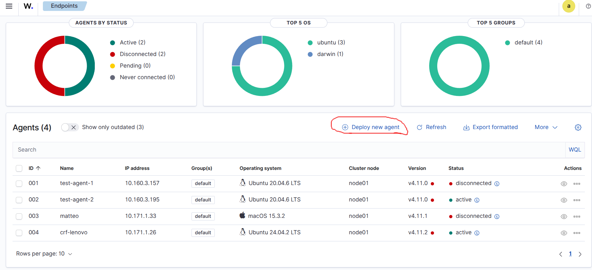

# Wazuh

From the official [Wazuh documentation](https://documentation.wazuh.com/current/index.html):

> Wazuh is a security platform that provides unified XDR and SIEM protection for endpoints and cloud workloads. The solution consists of a single universal agent and three core components: the Wazuh server, the Wazuh indexer, and the Wazuh dashboard.

---

# Installation Guide

## Wazuh Agent

Installing and deploying the Wazuh agent is straightforward. The easiest method is to follow the instructions provided in the Wazuh server dashboard:

**🔗 Dashboard Link:**  
[https://10.160.3.69/app/endpoints-summary#/agents-preview/](https://10.160.3.69/app/endpoints-summary#/agents-preview/)  
**Username:** `admin`  
**Password:** `SecretPassword`

Once you're in the *Agents Preview* section, click on **"Deploy new agent"**, as shown below:  


Then follow the steps outlined in the dashboard:

1. Select your system and architecture.
2. **Server address**: Use `10.160.3.69` in this case, or use the IP/FQDN of your main Wazuh server or any worker node.
3. Specify the agent name and select a group (currently, only **"Default"** is available).
4. Copy and paste the command provided to install the required packages.
5. Copy and paste the command to start the agent.
6. If the installation fails, check the logs:

    ```bash
    sudo tail -f /var/ossec/logs/ossec.log
    ```

---

## Wazuh Server

The Wazuh server is deployed outside the Controller Suite. To install and configure the server, follow the official guide:  
👉 [Wazuh Server Installation Instructions](https://documentation.wazuh.com/current/installation-guide/index.html)
