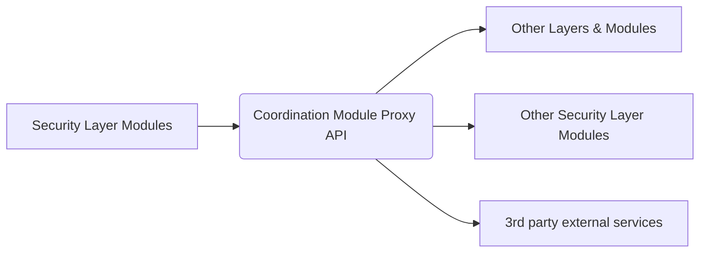

# Coordination Module Proxy API

API for communication between Security Layer modules and other (external) components.

```mermaid
flowchart LR
    A[Security Layer Modules]-->B(Coordination Module Proxy API);
    B-->C[Other Layers & Modules];
    B-->D[Other Security Layer Modules];
    B-->E[3rd party external services];
```
